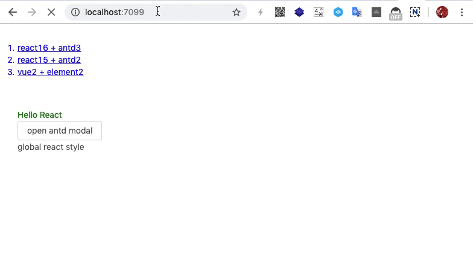

# qiankun（乾坤）

[](https://www.npmjs.com/package/qiankun)
[](https://codecov.io/gh/umijs/qiankun)
[](https://www.npmjs.com/package/qiankun)
[](https://travis-ci.org/umijs/qiankun)

> In Chinese traditional culture `qian` means heaven and `kun` stands for earth, so `qiankun` is the universe.

An implementation of [Micro Frontends](https://micro-frontends.org/), based on [single-spa](https://github.com/CanopyTax/single-spa), but made it production-ready.

## Usage

```shell
npm i qiankun -S
```

## Examples

```shell
npm i
npm run install:examples
npm start
```

Visit `http://localhost:7099`



```js
import { registerMicroApps, start } from 'qiankun';

function render({ appContent, loading }) {
  const container = document.getElementById('container');
  ReactDOM.render(<Framework loading={loading} content={appContent}/>, container);
}

function genActiveRule(routerPrefix) {
  return (location) => location.pathname.startsWith(routerPrefix);
}

registerMicroApps(
  [
    { name: 'react app', entry: '//localhost:7100', render, activeRule: genActiveRule('/react') },
    { name: 'vue app', entry: { scripts: [ '//localhost:7100/main.js' ] }, render, activeRule: genActiveRule('/vue') },
  ],
  {
    beforeLoad: [async app => {
      console.log('before load', app);
    }],
    beforeMount: [async app => {
      console.log('before mount', app);
    }],
    afterMount: [async app => {
      console.log('before mount', app);
    }],
    afterUnmount: [async app => {
      console.log('after unload', app);
    }],
  },
);

start({ prefetch: true, jsSandbox: true });
```

## Features

- [x] HTML Entry
- [x] Config Entry
- [x] Isolated styles
- [x] JS Sandbox
- [x] Assets Prefetch
- [ ] Nested Microfrontends
- [ ] [umi-plugin-single-spa](https://github.com/umijs/umi-plugin-single-spa) integration

## API

### registerMicroApps

```typescript
type RegistrableApp = {
  name: string; // app name
  entry: string | { scripts?: string[]; styles?: string[]; html?: string };  // app entry
  render: (props?: { appContent: string, loading: boolean }) => any;
  activeRule: (location: Location) => boolean;
  props?: object; // props pass through to app
};

type Lifecycle<T extends object> = (app: RegistrableApp<T>) => Promise<any>;
type LifeCycles<T extends object> = {
    beforeLoad?: Lifecycle<T> | Array<Lifecycle<T>>;
    beforeMount?: Lifecycle<T> | Array<Lifecycle<T>>;
    afterMount?: Lifecycle<T> | Array<Lifecycle<T>>;
    afterUnmount?: Lifecycle<T> | Array<Lifecycle<T>>;
};

function registerMicroApps<T extends object = {}>(apps: Array<RegistrableApp<T>>, lifeCycles?: LifeCycles<T>): void;
```

### start

```typescript
function start({ prefetch: boolean, jsSandbox: boolean }): void;
```

## Integration

### Main Framework

### Sub App

While you wanna build a sub app to integrate with qiankun, pls make sure your bundler have the required configuration below:

#### webpack:
```js
{
  libraryTarget: 'umd',
  library: packageName,
  jsonpFunction: `webpackJsonp_${packageName}`
}
```
see https://webpack.js.org/configuration/output/#outputlibrary

#### parcel:
```shell
parcel serve entry.js --global myvariable
```
see https://en.parceljs.org/cli.html#expose-modules-as-umd

## Community
https://github.com/umijs/umi#community
